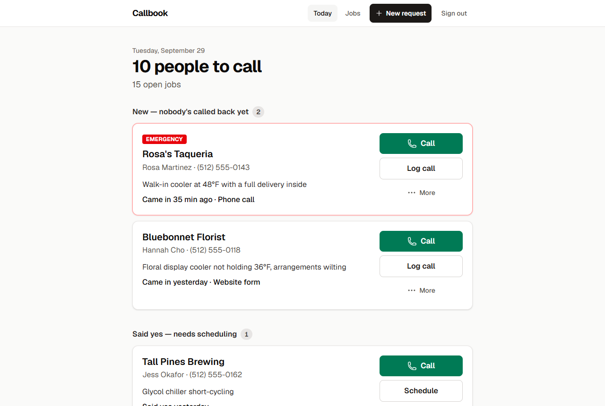
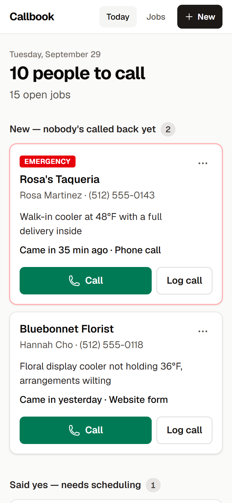
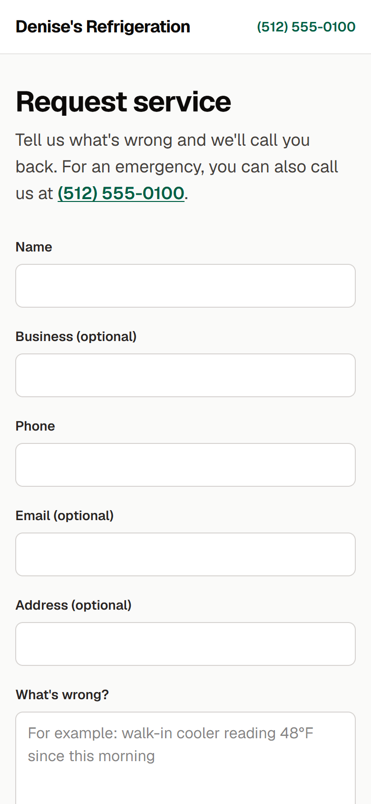
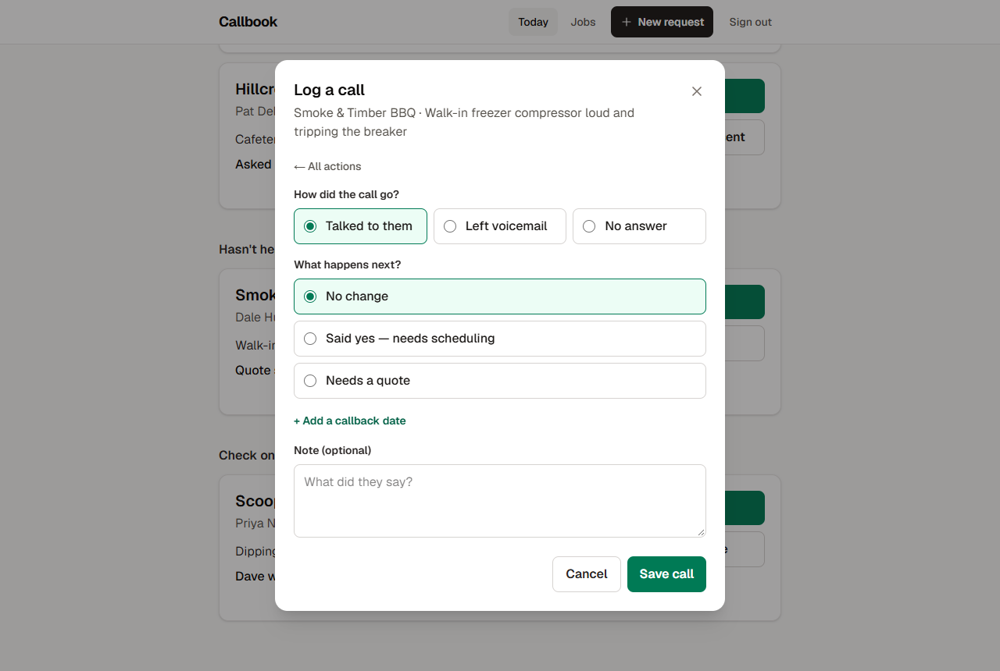
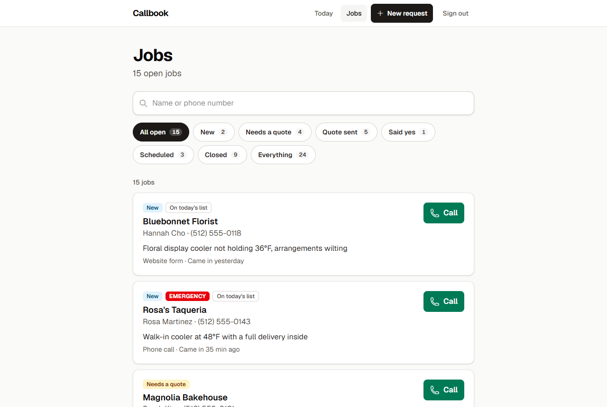
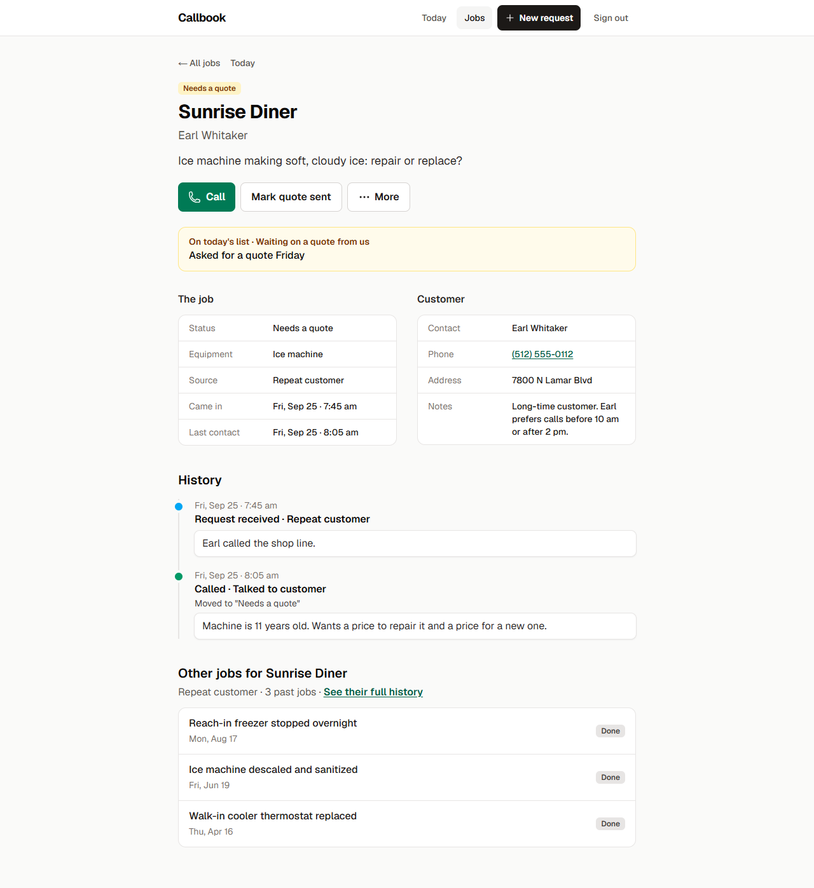
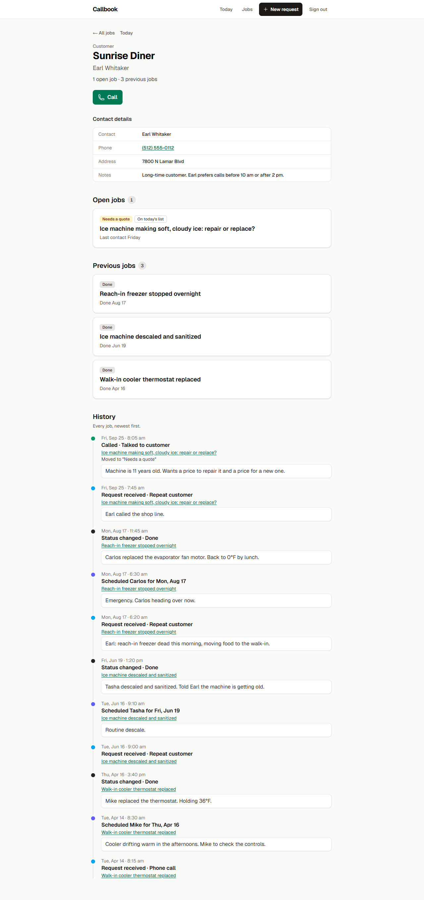

# Callbook

Callbook is a call list for Denise, who runs a commercial refrigeration repair business with four technicians. Every request goes into it, and each morning it tells her who to call and why.

> "I just want to wake up and know who I need to call today. Like, these three people are waiting on a quote, this one said yes and needs scheduling, this one has not heard from us in two days."



## The problem

Denise gets requests by phone, through her website, by email and text, from repeat customers and from referrals. She keeps track of them in her head and a notebook. Nothing reminds her when a job needs attention, so new requests get missed, quotes don't get chased, and she can't say how many jobs are open.

I treated this as a follow-up problem, not a field-service problem. She didn't ask for dispatch or invoicing, she asked for a list. In refrigeration repair a slow callback usually means the customer calls someone else, so what matters most is that nobody gets forgotten.

So Callbook does three things:

1. Gets every request into one place quickly, through her own quick-add form and a public form for her website.
2. Gives each job one status and keeps a history of everything that happened on it.
3. Works out from those statuses and dates who needs a call today. The list gets shorter as she works through it.

## What's in it

- **Today** is the home screen. It shows who to call, grouped by reason and worded the way Denise talks. Each card says why ("Quote sent Friday", "You said you'd call today") and has a Call button.
- **Actions** on every job:
  - log a call: talked, voicemail or no answer, plus what happens next
  - mark a quote sent, with the amount
  - schedule a tech and a date
  - set a callback date
  - mark it done
  - mark "didn't go ahead", with a reason
  - add a note

  Every action works the same from Today and from the job page.
- **New request** is a short form you can open from any page. It spots returning customers by phone number as you type ("Repeat customer: Sunrise Diner — 3 past jobs") and warns if they already have an open job.
- **Jobs** lists every job, with a count for each status, filters, and search by name or phone number.
- **Job page** has the details, the reason it's on Today (if it is), the same actions, and the full history.
- **Customer page** is read-only: contact details, open and past jobs, and one history across all their jobs.
- **Request service** (`/request`) is a public form for her website. What people send lands on Today as a new job from the "Website form".
- **Sign-in:** one shared password protects everything except `/request`.

It works on a phone (dialogs open as bottom sheets, buttons are big, phone numbers are tap-to-call) and on a desktop.

| Today on a phone | Public request form |
|---|---|
|  |  |

| Logging a call | Jobs |
|---|---|
|  |  |
| **Job page** | **Customer page** |
|  |  |

## How the call list works

Today isn't stored anywhere. It's worked out from each open job's status and dates every time the page loads, so it can't drift out of sync with the jobs. Each open job goes through these rules in order. The first rule that matches decides where it goes, so a job never appears twice.

| # | When | Shows under |
|---|---|---|
| 1 | The callback date is in the future | Hidden until that day |
| 2 | The job is new | New — nobody's called back yet |
| 3 | The customer said yes | Said yes — needs scheduling |
| 4 | The callback date is today or past | You said you'd call today (or "overdue N days") |
| 5 | It needs a quote | Waiting on a quote from us |
| 6 | No contact for 2+ business days (in practice, a quote waiting on the customer) | Hasn't heard from us in 2+ days |
| 7 | It's scheduled and the visit date has passed | Check on visits — did this get done? |

Some details that matter day to day:

- Talking to someone, leaving a voicemail, sending a quote and scheduling a visit all count as contact. Contact restarts the two-day clock and clears the callback date.
- "No answer" doesn't count as contact. It's still logged, and the job is hidden until the next business day so it stops nagging her today. Emergencies are never hidden this way.
- A scheduled job is judged only by its visit date, never by how quiet it's been.
- Within a section, emergencies come first, then whoever has waited longest.
- The headline counts people, not jobs. Two jobs for the same customer is one call.

The rules are in `src/lib/followups.ts`. That's the most heavily tested part of the app.

## Decisions and assumptions

- **"Two days" means two business days.** Denise didn't say which she meant. Counting calendar days would dump all of Friday's calls onto Monday's list at once. It's one constant (`SILENCE_BUSINESS_DAYS` in `src/lib/config.ts`), and it's the first thing I'd check with her.
- Business days are Monday to Friday in her timezone, which I've assumed is US Central (`America/Chicago`). Public holidays count as business days.
- Denise is the only user. The techs keep reporting back to her, and she updates Callbook. That's why there's one shared password and no accounts.
- She keeps sending quotes the way she does now. Callbook only records the amount and the date.
- Callback and visit dates are stored as plain dates (`2026-09-29`), not timestamps, so a timezone can't shift them by a day.
- Returning customers are matched on the digits of their phone number, so "(512) 555-0112" and "512.555.0112" are the same customer. The match runs again inside the save, so the same customer can't be created twice.
- The public form never changes an existing customer's record, not even to fill in a blank field, because anyone can type anyone's phone number. Whatever they typed goes into the request's note for Denise to look at. Everyone gets the same thank-you message, so the form never reveals whether a number belongs to a customer.
- Spam protection on the public form is a hidden honeypot field plus validation and length limits on the server. There's no CAPTCHA.
- The business name and phone number on the public page are placeholders (`BUSINESS_NAME` and `BUSINESS_PHONE` in `src/lib/config.ts`), because the brief doesn't name her company.
- Numbers like these are constants in the code rather than a settings screen. I'd tune them by talking to her.

## What I left out on purpose

I left out dispatch boards and calendars, invoicing and payments, a technician app, SMS and email integrations, analytics and charts, roles and permissions, inventory, and AI features. With four techs, a name and a date is enough scheduling. None of the rest came up as something that's hurting her, and each would be one more thing for her to learn. The follow-up rules are simple and predictable. An AI model wouldn't improve them, and it would make the list harder to trust.

## Architecture

It's a single Next.js app. Pages are server components that read from the database, and every change goes through a Server Action. Each action follows the same four steps:

1. **Validate** the form (`src/lib/action-inputs.ts`).
2. **Plan** the change with a pure function (`src/lib/job-actions.ts`, `src/lib/new-request.ts`). The plan lists exactly which job fields change and the one activity to record. A status change goes in that activity's details.
3. **Apply** the plan in one transaction (`src/db/mutations/`).
4. **Refresh** every page, so Today, Jobs and the job page always agree.

Every change writes its activity in the same transaction as the change itself. So the history on a job or customer page is just those activities turned into sentences (`src/lib/timeline.ts`). Pages get their words already written by small view functions (`src/lib/*-view.ts`). That means the wording is unit-tested, and the components only handle layout.

```
src/
  app/(callbook)/    Denise's pages: Today, Jobs, job and customer pages (signed in)
  app/(public)/      /request, with its own plain layout
  app/login/         sign-in page
  app/*-actions.ts   Server Actions
  proxy.ts           the sign-in gate
  lib/               rules, plans, wording, dates, auth (no database access)
  db/                schema, queries, mutations, demo data
  components/
drizzle/             SQL migrations
e2e/                 browser regression script
```

**Sign-in.** The right password sets a signed cookie (HMAC-SHA256, httpOnly, valid for 30 days). `src/proxy.ts` checks that cookie on every request except `/request` and `/login`.

- A signed-out page visit goes to the sign-in page. After signing in you land back where you were going.
- Any other signed-out request gets a 401.
- Each internal Server Action also checks the session itself. Next.js picks which action to run from a request header, not the URL, so the proxy alone wouldn't be enough.
- The signed-in layout checks the session once more.

## Tech stack

The app uses Next.js 16 (App Router) with TypeScript and Tailwind CSS. The dialogs and bottom sheets are Radix Dialog, the only UI library. Data goes through Drizzle ORM over libSQL: a SQLite file locally and Turso in production. Dates are handled with date-fns and date-fns-tz, and the tests use Vitest. It's set up to deploy to Vercel.

I chose SQLite and Turso because they need no setup locally, the same driver works in production, and they're plenty for a five-person business.

## Running it locally

You need Node.js 22 or later.

```bash
npm install
npm run dev
```

The first `npm run dev` does two things before starting:

- It creates `.env.local` with a random sign-in password and signing secret, and prints the password. That file is gitignored, and you can change the password in it.
- It creates `data/callbook.db`, applies the migrations and loads the demo data.

Open http://localhost:3000 and sign in with the printed password. The public form is at http://localhost:3000/request.

### Environment variables

| Variable | Needed | What it's for |
|---|---|---|
| `CALLBOOK_PASSWORD` | Always | The shared sign-in password |
| `AUTH_SECRET` | Always | Signs the session cookie. At least 32 characters. Changing it signs everyone out. |
| `DATABASE_URL` | Production | Turso database URL (`libsql://…`). Leave it unset locally to use `data/callbook.db`. |
| `DATABASE_AUTH_TOKEN` | Production | Turso auth token |

If the password or the secret is missing, sign-in doesn't work and nothing internal can be opened. There's no fallback password. All four variables are listed in `.env.example`.

### Database

| Command | What it does |
|---|---|
| `npm run db:reset` | Delete everything and reload the demo data |
| `npm run db:migrate` | Apply pending migrations |
| `npm run db:seed` | Load the demo data into an empty database |
| `npm run db:generate` | Create a migration after changing `src/db/schema.ts` |
| `npm run db:studio` | Browse the data in Drizzle Studio |

The demo data has 4 techs, 20 customers and 24 jobs, each job with its full history. That includes a repeat customer with three past jobs. All the phone numbers are fictional 555-01xx numbers. Dates are set relative to when you load the data, counted in business days, so Today looks the same whatever day you load it on. They don't move after that (see Known limitations).

### Tests

```bash
npm test          # unit and integration tests (Vitest)
npm run check     # typecheck, lint and tests
npm run e2e       # browser regression
```

There are 938 Vitest tests. They focus on the parts that are easy to get wrong:

- the follow-up rules, table-driven and including weekends and timezone edges
- business-day math
- the demo data, checked at 35 points across a week
- the wording on cards and in histories
- each action's plan
- the Server Actions, run against an in-memory copy of the demo database
- repeat-customer matching and the public form's rules
- sign-in: tokens, the proxy, and every internal action refusing to run without a session

`npm run e2e` drives a real browser: installed Microsoft Edge by default, or `BROWSER_CHANNEL=chrome` for Chrome. It covers:

- the public form, for a new and a returning customer, checking the page gives nothing away
- signing in
- every action on Today, and New request
- Jobs search and filters, and the job and customer pages
- reloading
- opening internal pages while signed out, and replaying a captured Server Action without a session

It runs at desktop width and at 360px and 390px, and it fails on any console error. It expects fresh demo data and changes it. So run it against `npm run build && npm start`, with `npm run db:reset` before and after. To point it at a deployed copy, set `BASE_URL` and `CALLBOOK_PASSWORD`.

I also ran an axe-core accessibility check (WCAG 2.1 A and AA) on every page and the main dialogs, at desktop and phone width. It found no issues. That script isn't in the repo.

## Deploying (Vercel + Turso)

The application is deployed on Vercel with Turso as the production database.

### Production setup

1. Create a Turso database and obtain its URL and authentication token.
2. Import the repository into Vercel.
3. Configure these environment variables for **Production**:
   - `DATABASE_URL`
   - `DATABASE_AUTH_TOKEN`
   - `CALLBOOK_PASSWORD`
   - `AUTH_SECRET`
4. Deploy the `main` branch.

The Vercel build runs `npm run vercel-build`, which applies database migrations, seeds the database if it is empty, and then builds the application.

The production application is available at:

https://callbook-one.vercel.app

## Local database reset

For local development/demo testing, the database can be reset and reseeded with:

```bash
npm run db:reset

## How to demo

### Production demo
```
Open:

https://callbook-one.vercel.app

Sign in using the reviewer password provided with the submission.

The production demo includes seeded Callbook data covering new requests, quotes, callbacks, scheduling, completed work, and customer history.

A typical walkthrough:

1. Open **Today** to see who needs follow-up.
2. Open a job and use **Log call** to record a call outcome.
3. Use **Mark quote sent** to move a job through the quote workflow.
4. Open **Tall Pines Brewing**, use **Schedule**, select a technician and date, and save the visit.
5. Use **New request** to create a new job and verify it appears on Today and Jobs.
6. Open **Jobs**, search for a customer, filter by status, and open a job to view its history.
7. Open a customer's history to see their jobs and combined activity.
8. Sign out and verify that protected pages require authentication.
9. Open `/request` in a private window to test the public request form.

### Local demo

For a fresh local database:

```bash
npm run db:reset

## Known limitations
```
- Single shared password for internal access; there is no per-user account or role system.
- No in-app editing or deleting of existing customer/job information.
- Email and text requests still need to be entered manually through New request.
- No automatic reminders or notifications; users need to open the app to see the follow-up list.
- No in-app rate limiting; the public request form includes a honeypot.

## What could come next

It depends on what Denise says. Likely candidates:

- a 7 am email or text with the day's list
- a "waiting on parts" status, if jobs often stall there
- editing customer details
- a holiday calendar
- separate logins, if the techs ever start using it

The Vercel rate-limit rule should go in as soon as it's deployed.

## Questions I'd ask Denise

1. When you said "two days", did you mean business days? Do you take emergency calls at the weekend?
2. Do jobs often sit waiting on parts?
3. Who sends the quotes, you or the techs? Is it useful to record the amount?
4. Would a morning email or text of the list suit you better than opening an app?
